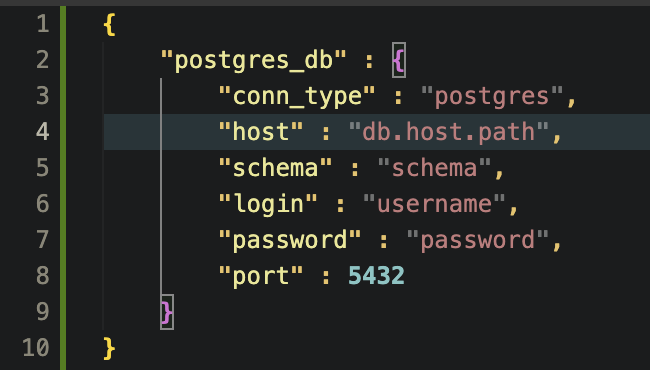

# Board Game Analytics - ETL Pipeline

[](https://github.com/boardgameanalytics/bga-pipeline/actions/workflows/flake8.yml)
[](https://github.com/boardgameanalytics/bga-pipeline/actions/workflows/pytest.yml)
[](https://shields.io/)
[](https://opensource.org/licenses/MIT)

A fully automated ETL pipeline using Apache Airflow, BeautifulSoup4, Pandas, and Postgres to create a data warehouse of board game data from [BoardGameGeek.com](https://boardgamegeek.com/) using their [BGGXMLAPI2](https://boardgamegeek.com/wiki/page/BGG_XML_API2).

This pipeline was created to prepare and deliver data for modeling and analysis in the [Boardgame Project Dashboard](https://github.com/boardgameanalytics/bga-web-dashboard).

# Contents
- [How to Use](#how-to-use)
- [Customizations](#customizations)
- [Contributors](#contributors)


# How to Use

## Clone repo
Clone this repo to where you want the docker environment to run out of:

```bash
git clone git@github.com:boardgameanalytics/bga-pipeline.git
```

## Create .env
Create a `.env` file in the project directory and add your BGG login credentials
(for getting game ids) as:

```
BGG_USERNAME="your_username"
BGG_PASSWORD="your_password"
```

## Create `airflow_connections.json`
Create a json file in the `config` directory named `airflow_connections.json`
and populate it with the connection details for the database:



**IMPORTANT: The name `postgres_db` must be used for the database that is to be populated
by the pipeline.**

Connections in this file will be imported when the Docker container is started.

## Setup Docker Environment

Build the custom `bgg-airflow` docker image. 
Initialize airflow and the `data` directory
```
make init
```

Start the full docker environment
```
make up
```
You should now be able to access the Airflow webserver at `http://localhost:8080` and continue configuration there.

To stop the container
```
make down
```


# Customizations

## Airflow Configuration
Airflow will import connections and variables from the json files in `configs/`
when the `configs/setup_airflow.sh` script is run during the `make up` command.

- `configs`
  - `airflow_connections.json`
  - `airflow_variables.json`

*WARNING: Changing existing variable or connection entries may cause unexpected behavior!*

# Contributors
- [Randy Nance](https://github.com/randynobx) - *Data Engineer*
